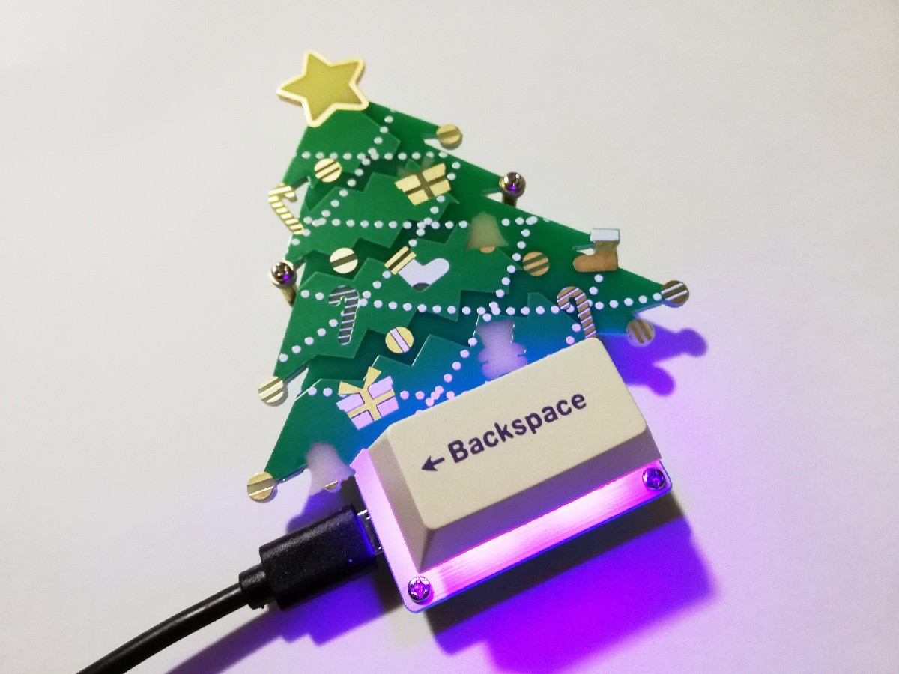
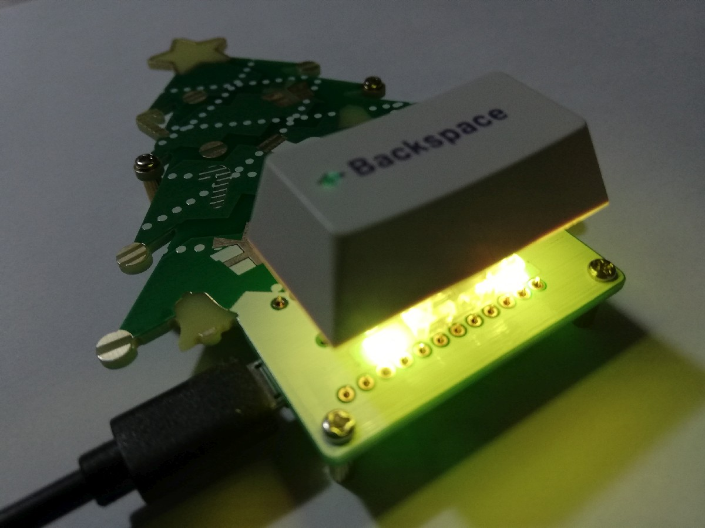
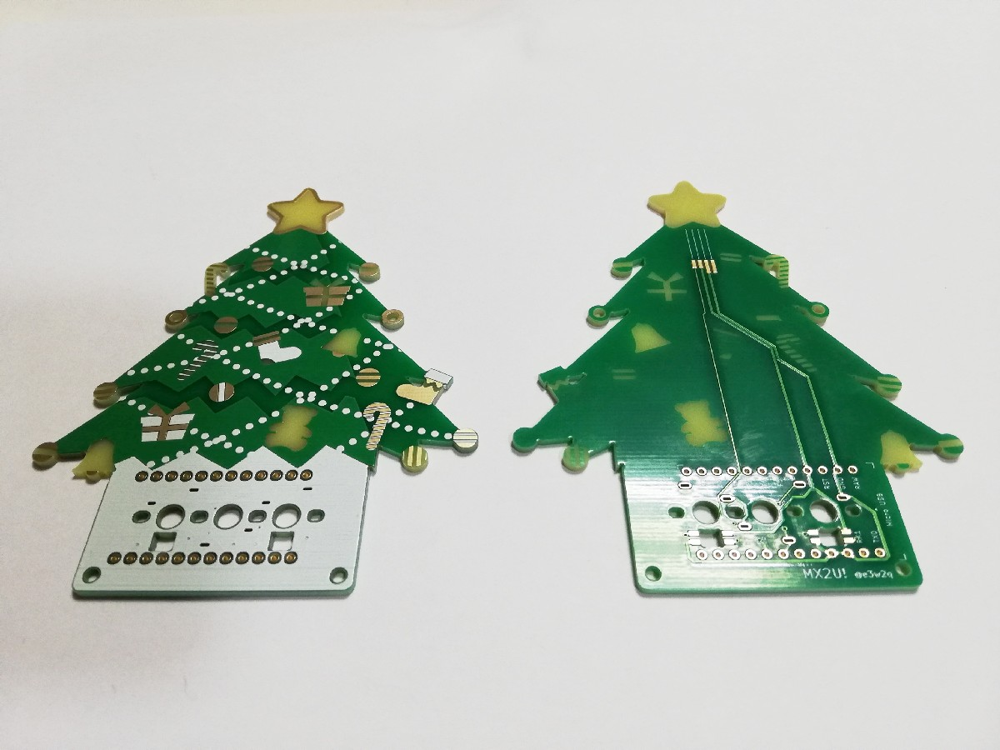

# MX2U!

Happy Holidays Macro Pad.

## What is the MX2U! ?

MX2U! is a macro pad for MX switches that can be used for fun at certain times of the year.

You can place a single 2U key or two 1U keys on this macro pad.

Note: When using the 2U key, the backlight goes directly into your eyes!

## Link

[Hardware data (PCB)](pcb/)

[Firmware](https://github.com/e3w2q/qmk_firmware/tree/e3w2q/keyboards/e3w2q/mx2u)

[PCBの入手方法](doc/pcb_order_guide_jp.md)

[パーツリスト](doc/bom_list_jp.md)

[ビルドガイド](doc/readme_jp.md)

