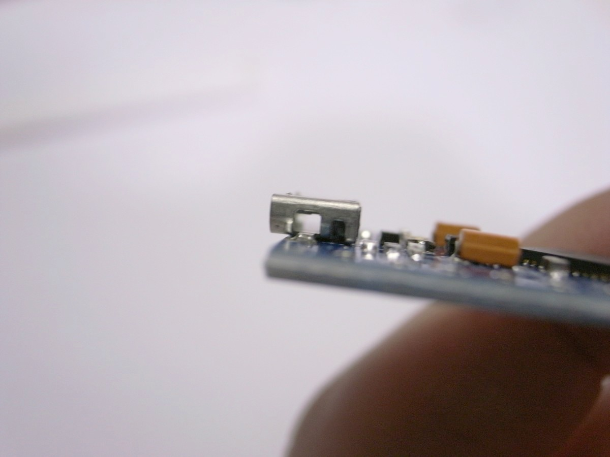
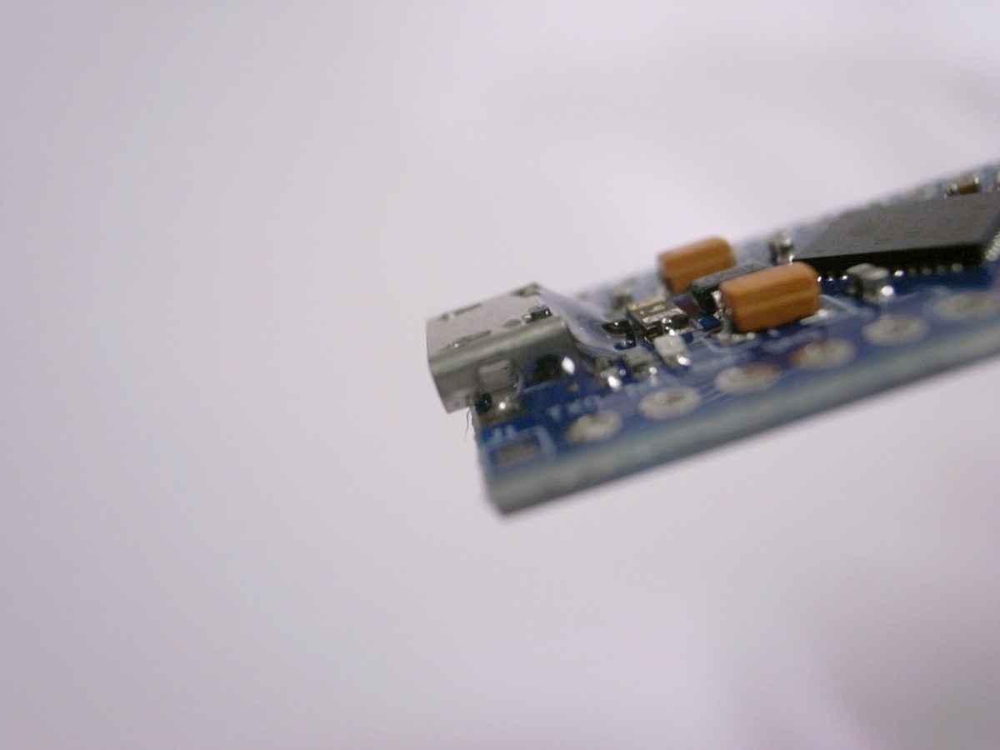

# MX2U! ビルドガイド

<!-- TOC -->

- [MX2U! ビルドガイド](#mx2u-ビルドガイド)
    - [必要なパーツ](#必要なパーツ)
    - [使用する道具、消耗品](#使用する道具消耗品)
    - [ビルドガイド](#ビルドガイド)
        - [Pro Microのもげ防止加工](#pro-microのもげ防止加工)
        - [はんだ付けのイメージトレーニング](#はんだ付けのイメージトレーニング)
        - [キースイッチ部分のLEDの取り付け](#キースイッチ部分のledの取り付け)
        - [ツリー部分のLEDの取り付け](#ツリー部分のledの取り付け)
        - [キースイッチの取り付け](#キースイッチの取り付け)
        - [Pro Microの取り付け](#pro-microの取り付け)
        - [スペーサーの取り付け](#スペーサーの取り付け)
        - [キーキャップの取り付け](#キーキャップの取り付け)
        - [ファームウェアの書き込み](#ファームウェアの書き込み)
        - [光るパターンを変える](#光るパターンを変える)

<!-- /TOC -->

## 必要なパーツ

[MX2U! パーツリスト](bom_list_jp.md)をご覧ください。

## 使用する道具、消耗品

[使用する道具、消耗品](tool_guide_jp.md)におすすめの道具類、注意事項等をまとめましたのでご覧ください。

## ビルドガイド

### Pro Microのもげ防止加工

Pro Microにエポキシ接着剤を盛って、簡単にはもげないようにします。

参考1:[ProMicroのモゲ防止ついでにQMK_Firmwareを書き込む - Qiita](https://qiita.com/hdbx/items/2f3e4ddfcadda2a5578e)
参考2:[もげ予防 - Self-Made Keyboards in Japan](https://scrapbox.io/self-made-kbds-ja/%E3%82%82%E3%81%92%E4%BA%88%E9%98%B2)

エポキシ接着剤の2液を混ぜます。


接着剤を付け始める前にMicro USBコネクタを横から見てください。側面に穴が開いています。この穴に接着剤が入ると端子が入らなくなったり、入りにくくなったりします。



この穴を避けて、つまようじなどで接着剤を盛っていきます。



乾くまで置いておきます。

### はんだ付けのイメージトレーニング

はんだ付けに慣れている方は次の項に進んでください。

全くはんだ付けをしたことがなかったり、数年ぶりにはんだ付けをする場合は、以下の動画が参考になります。

- [はんだ付けの詳細.m2p - YouTube](https://www.youtube.com/watch?v=ZA-ehWjRfYM)

- [チップ抵抗のはんだ付けと、はんだ量の調整（体験用基板を使用） - YouTube](https://www.youtube.com/watch?v=vqKKElJ1vw0)

- [基礎からわかる！自キ入門講座 第8回「自作キーボードのつくりかた #2」 - YouTube](https://www.youtube.com/watch?v=LOC53FeU-QM&t=999)

### キースイッチ部分のLEDの取り付け

**基板裏側**にLEDを取り付けます。

ツリーが描いてある側が基板の表で、反対側が裏です。画像は右側が裏です。


YS-SK6812MINI-Eを取り付けます。向きは写真のように欠けているタブが左下に向くようにして開口部に置き、はんだ付けしてください。

高い温度ではんだ付けを行うと破損の可能性がありますので、温調機能付きはんだごてで270～320度程度に設定してはんだ付けしてください。


### ツリー部分のLEDの取り付け

**この項はまだ未検証です**。

ツリー部分の裏側に、スルーホールタイプのシリアルLED（WS2812）を取り付けます。

裏側から見て左から、Data in(DIN)、電源(VCC)、Ground(GND)、Data out(DOUT)となるように配置します。

はんだ付けしやすいように足をあらかじめ曲げておき、テープ等で固定するとやりやすいです。


### キースイッチの取り付け

2Uのキーキャップを使う場合は真ん中に1個、1Uのキーキャップを使う場合は2個、表側から差し込みます。キースイッチの足が曲がっている場合はまっすぐにしてから差し込んでください。

2Uキーキャップを使いたい場合は以下の注意点があります。

- バックライトを光らせるとキースイッチを透過せずにダイレクトに光が出るので、まぶしい
- スタビライザーは使用できない


裏返します。

スイッチ2個の足がPro Microに干渉しないよう、はみ出した部分をニッパーでカットします。

ハンダ付けします。


### Pro Microの取り付け

**基板裏側**のPro Micro設置部分のスルーホールに、コンスルーピンヘッダを根本まで差し込みます。

その際、

- コンスルーピンヘッダの金色の窓が遠い側を基板側とし、金色の窓が近い側をProMicro側とする
- 金色の窓の向きを揃える

ようにしてください。

参考: [Helixベータ ビルドガイド](https://github.com/MakotoKurauchi/helix/blob/master/Doc/buildguide_jp.md#pro-micro)


ピンヘッダにPro Microを差し込みます。**Pro Microの裏面（平らなほう）が上になるように、またマイクロUSBが基板端になるように**します。

**向きを間違えるとリカバリーが大変です。表裏、左右をよく確認してください。**


Pro Microとコンスルーピンヘッダをハンダ付けします。まず四隅をハンダ付けし、横から見てコンスルーピンヘッダとの間に隙間があれば押さえながらハンダを温めて浮かないようにします。そのあと、順番に全てハンダ付けします。

基板とコンスルーピンヘッダは接触しているため、ハンダ付けしません。

### スペーサーの取り付け

基板4箇所の穴に表側からM2ネジをはめ、裏側からスペーサーをねじ込みます。

### キーキャップの取り付け

キースイッチにキーキャップをはめます。

### ファームウェアの書き込み

以下のリンク先を参考にして、QMK Firmwareのビルド環境を用意します。

- Windows
  - [QMKビルド環境の構築(Windows Msys2編)](https://gist.github.com/e3w2q/4bc86e531d1c893d3d13af3e9895a94a)
- macOS
  - [セットアップ - QMK Firmware](https://docs.qmk.fm/#/ja/newbs_getting_started?id=macos)
- Linux
  - [セットアップ - QMK Firmware](https://docs.qmk.fm/#/ja/newbs_getting_started?id=linux)

構築中、

```
qmk setup
```

と入力する代わりに

```
qmk setup e3w2q/qmk_firmware --branch e3w2q
```

と入力してください。

または、`qmk setup`した後に、`C:\Users\USER_NAME\qmk_firmware\keyboards`配下に[https://github.com/e3w2q/qmk_firmware/tree/e3w2q/keyboards/e3w2q](https://github.com/e3w2q/qmk_firmware/tree/e3w2q/keyboards/e3w2q)以下をコピーしてもよいです。

用意されたキーマップを書き込むには以下を実行します。

```
qmk flash -kb e3w2q/mx2u -km default
```

`Detecting USB port, reset your controller now...`と表示されたらPro Microの`GND`と`RST`をピンセットやクリップなどで短絡させると書き込みが始まります。


[QMK Configuratorのテストモード](https://config.qmk.fm/#/test)でキー入力が行えるかテストしてください。

### 光るパターンを変える

デフォルトのキーマップではGNDと以下のピンをピンセットやクリップなどで導通させることで、LEDの設定を変更できます。


